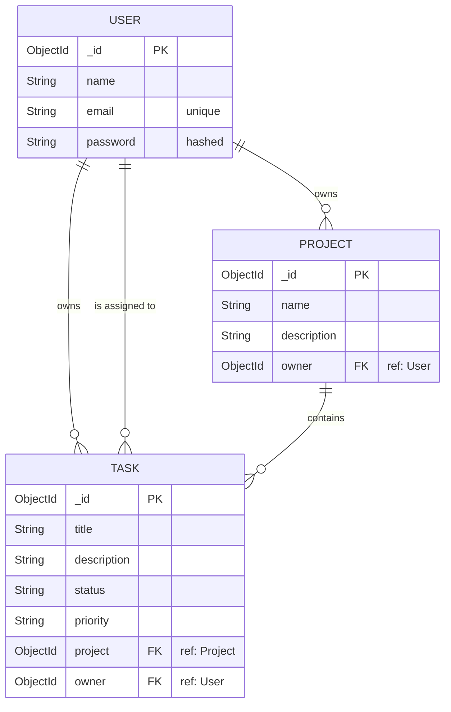

# SprintForge


[**🔗 View Live Demo Here**](https://mern-agile-tracker.vercel.app)

SprintForge is a Kanban-style project management tool I built to handle agile workflows. It lets you create workspaces, track tasks, and move them around with drag-and-drop. 

I built this to get hands-on experience with full-stack TypeScript, JWT authentication, and optimistic UI updates.

## Features
- **Kanban Board:** Drag and drop tasks between "To Do", "In Progress", and "Done".
- **Workspaces:** Create different projects and switch between them from the sidebar.
- **Auth:** Standard email/password login using JWTs and bcrypt.
- **Optimistic UI:** When you move a task, the UI updates instantly while the backend syncs in the background.

## Tech Stack
- **Frontend:** React (Vite), TypeScript, Zustand, `@hello-pangea/dnd`
- **Backend:** Node.js, Express, TypeScript, Zod (for validation)
- **Database:** MongoDB, Mongoose

## Database Schema



## Running it locally

1. **Clone the repo**
   ```bash
   git clone https://github.com/yourusername/sprintforge.git
   cd sprintforge
   ```

2. **Start the backend**
   ```bash
   cd backend
   npm install
   cp .env.example .env
   npm run seed # Creates the demo user
   npm run dev
   ```

3. **Start the frontend**
   ```bash
   cd frontend
   npm install
   cp .env.example .env
   npm run dev
   ```

4. **Login**
   Head over to `http://localhost:5173` and use the demo credentials generated by the seed script:
   - Email: `recruiter@demo.com`
   - Password: `password123`