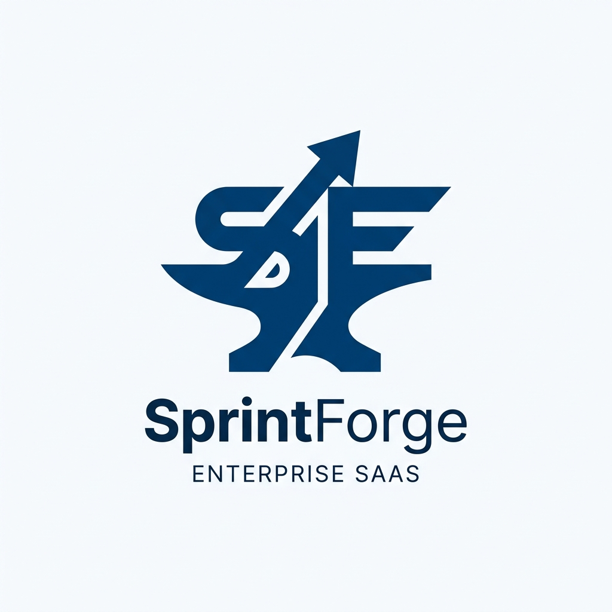
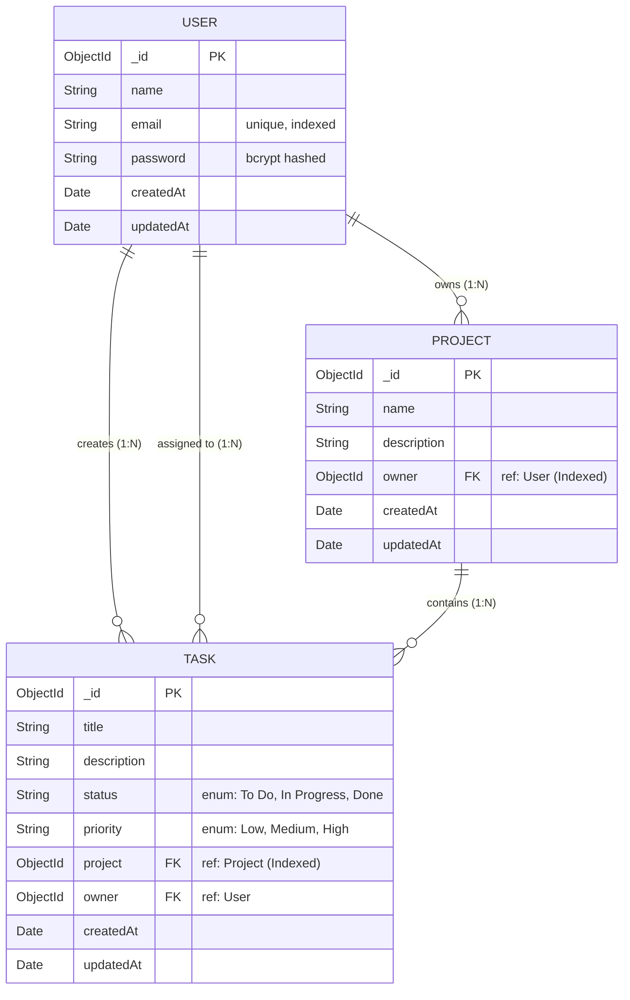

# SprintForge



[**🔗 View Live Demo Here**](https://sprintforge-tracker.vercel.app)

SprintForge is a high-performance, Kanban-style project management tool engineered to streamline agile workflows. I built this application from the ground up to solve the friction in task tracking, focusing heavily on a fluid user experience and robust data synchronization. 

This project serves as a showcase of modern full-stack web development, demonstrating my ability to build scalable REST APIs, secure authentication flows, and complex client-side state management using React.

---

## 🚀 Key Features

* **Interactive Kanban Interface:** A frictionless drag-and-drop board powered by `@hello-pangea/dnd`. Tasks can be seamlessly transitioned between `To Do`, `In Progress`, and `Done` states.
* **Isolated Workspaces:** Users can instantiate multiple, isolated projects. The sidebar navigation allows for instant context switching between different workspaces without page reloads.
* **Optimistic UI Rendering:** To guarantee a snappy user experience, state mutations (like moving a task) are updated instantly on the client via Zustand, while the database synchronization happens asynchronously in the background.
* **Secure Authentication:** Implemented a robust authentication pipeline utilizing JSON Web Tokens (JWT) for session management, bcrypt for password hashing, and Zod for strict runtime schema validation.
* **Responsive Architecture:** A fully responsive, custom-styled interface that maintains layout integrity across varying viewport sizes, utilizing standard CSS (avoiding utility-class bloat).

---

## 🛠️ Technology Stack & Architecture

### Frontend (Client-Side)
* **Framework:** React 18 + Vite (Chosen for lightning-fast HMR and optimized production builds)
* **Language:** TypeScript (Ensuring end-to-end type safety and reducing runtime errors)
* **State Management:** Zustand (Selected over Redux for its lightweight footprint and unopinionated API)
* **Routing:** React Router v6 (Client-side routing for SPA architecture)
* **Styling:** Vanilla CSS3 + Lucide React (Icons)

### Backend (Server-Side)
* **Runtime:** Node.js
* **Framework:** Express.js (REST API architecture)
* **Language:** TypeScript
* **Validation:** Zod (Strict payload validation before database interaction)
* **Authentication:** JWT (JSON Web Tokens) & bcryptjs

### Database (Data Layer)
* **Database:** MongoDB Atlas (Cloud-hosted NoSQL)
* **ORM:** Mongoose (Schema definitions and query building)

---

## 🗃️ Database Schema

The database is structured around three core entities: Users, Projects, and Tasks. The relationships are designed to enforce strict ownership and data isolation.



---

## 🔌 API Reference

The backend exposes a RESTful API. All routes (except `/auth/register` and `/auth/login`) require a valid Bearer Token in the `Authorization` header.

### Authentication
* `POST /api/auth/register` - Register a new user account
* `POST /api/auth/login` - Authenticate and receive a JWT

### Projects
* `GET /api/projects` - Retrieve all projects owned by the authenticated user
* `POST /api/projects` - Create a new project workspace

### Tasks
* `GET /api/tasks/:projectId` - Retrieve all tasks scoped to a specific project
* `POST /api/tasks` - Create a new task within a project
* `PUT /api/tasks/:id` - Update task details (status, title, description)
* `DELETE /api/tasks/:id` - Permanently delete a task

---

## 🧠 Design Decisions & Trade-offs

1. **Zustand over Redux:** For this specific application scale, Redux introduces unnecessary boilerplate. Zustand provided a much cleaner API to manage the global authentication state and project context without sacrificing performance.
2. **Custom CSS over Tailwind:** While utility-first frameworks like Tailwind are excellent for rapid prototyping, I opted to write custom CSS to demonstrate a deep understanding of CSS fundamentals, Flexbox/Grid layouts, and cascading rules.
3. **TypeScript Integration:** Migrating from JavaScript to TypeScript midway through development significantly reduced runtime bugs, especially when handling complex API payloads and Mongoose schema definitions.

---

## 💻 Local Environment Setup

To run this project locally on your machine, follow these steps:

### Prerequisites
- Node.js (v18+)
- MongoDB (Running locally on port 27017 or via Atlas)

### 1. Clone the repository
```bash
git clone https://github.com/yourusername/sprintforge.git
cd sprintforge
```

### 2. Backend Initialization
```bash
cd backend
npm install

# Create environment file
cp .env.example .env
# Edit .env and ensure MONGO_URI is set (defaults to mongodb://127.0.0.1:27017/sprintforge-db)

# Seed the database with a demo account
npm run seed

# Start the Express API (runs on port 5000)
npm run dev
```

### 3. Frontend Initialization
```bash
# Open a new terminal
cd frontend
npm install

# Create environment file
cp .env.example .env
# Ensure VITE_API_URL=http://localhost:5000 is set

# Start the Vite development server (runs on port 5173)
npm run dev
```

### 4. Access the Application
Open [http://localhost:5173](http://localhost:5173) in your browser.
You can log in using the demo account generated by the seeder:
- **Email:** `recruiter@demo.com`
- **Password:** `password123`

---

## 📈 Future Roadmap

* **Collaborative Workspaces:** Implementing WebSockets (Socket.io) to allow multiple users to edit the same Kanban board simultaneously in real-time.
* **Role-Based Access Control (RBAC):** Introducing `Admin`, `Editor`, and `Viewer` roles for project members.
* **Task Attachments:** Integrating AWS S3 for uploading files and images directly to task cards.