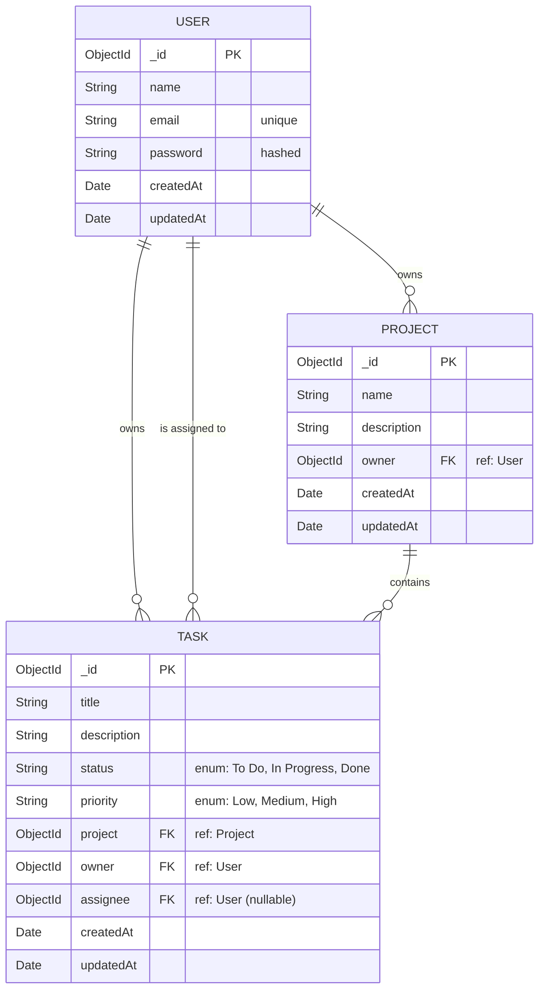

# SprintForge


**SprintForge** is a modern, high-performance Kanban board and project management tool designed to streamline agile workflows. It features an intuitive drag-and-drop interface, real-time status updates, and secure JWT-based authentication. 

Built from the ground up with a focus on premium UI/UX, SprintForge utilizes modern technologies to ensure reliability, scalability, and an excellent developer experience.

---

## 🚀 Features

- **Agile Kanban Board**: Organize tasks into "To Do", "In Progress", and "Done" columns.
- **Drag & Drop**: Seamlessly move tasks across columns with fluid physics powered by `@hello-pangea/dnd`.
- **Project Workspaces**: Create unlimited projects and toggle between them instantly in the sidebar.
- **Secure Authentication**: JWT-based authentication with bcrypt password hashing and Zod schema validation.
- **Optimistic UI Updates**: State changes reflect instantly in the browser via Zustand while synchronizing with the backend in the background.

---

## 🛠️ Tech Stack

### Frontend
- **React.js** (Vite for lightning-fast HMR)
- **TypeScript** (Strict typing for robust components)
- **Zustand** (Lightweight global state management)
- **React Router v6** (Client-side navigation)
- **Vanilla CSS** (Custom scoped styling without utility class bloat)

### Backend
- **Node.js & Express** (REST API)
- **TypeScript** (End-to-end type safety)
- **MongoDB & Mongoose** (NoSQL Database)
- **Zod** (Runtime schema validation)
- **JWT & bcryptjs** (Security and Authentication)

---

## 🗃️ Database Architecture

Below is the Entity Relationship (ER) Diagram representing how data flows in SprintForge:



---

## 📂 File Organization

The repository is structured as a monorepo containing both the `frontend` and `backend` applications.

```text
SprintForge/
├── backend/
│   ├── middleware/      # Express middleware (Auth, Error handling)
│   ├── models/          # Mongoose Schemas (User, Project, Task)
│   ├── routes/          # API endpoints
│   ├── scripts/         # Utility scripts (Database seeder)
│   ├── types/           # Global TypeScript interfaces
│   ├── .env.example     # Environment variable template
│   └── server.ts        # Express server entry point
│
├── frontend/
│   ├── public/          # Static assets (Logo, Favicon)
│   ├── src/
│   │   ├── components/  # Reusable React components (Kanban, Sidebar, Modals)
│   │   ├── pages/       # Route-level components (Login, Register, Dashboard)
│   │   ├── store/       # Zustand state stores
│   │   ├── types/       # Global TypeScript interfaces
│   │   └── main.tsx     # React application entry point
│   ├── .env.example     # Environment variable template
│   └── index.html       # HTML template
│
└── .gitignore           # Global git ignore configuration
```

---

## 💻 Local Setup Instructions

### Prerequisites
- Node.js (v18+)
- MongoDB (Running locally on port 27017 or via Atlas)

### 1. Clone the repository
```bash
git clone https://github.com/yourusername/sprintforge.git
cd sprintforge
```

### 2. Backend Setup
```bash
cd backend
npm install

# Create environment file
cp .env.example .env
# Edit .env and ensure MONGO_URI is set (defaults to mongodb://127.0.0.1:27017/sprintforge-db)

# Seed the database with demo data
npm run seed

# Start the development server (runs on port 5000)
npm run dev
```

### 3. Frontend Setup
```bash
# Open a new terminal
cd frontend
npm install

# Create environment file
cp .env.example .env
# Ensure VITE_API_URL=http://localhost:5000 is set

# Start the Vite development server (runs on port 5173)
npm run dev
```

### 4. Access the Application
Open [http://localhost:5173](http://localhost:5173) in your browser.
You can log in using the demo account generated by the seeder:
- **Email:** `recruiter@demo.com`
- **Password:** `password123`

---

## ☁️ Deployment Configuration

To deploy SprintForge to production environments (like Vercel, Render, or Heroku):

1. **Database:** Create a MongoDB Atlas cluster and obtain the connection string.
2. **Backend:** Set the following environment variables on your host:
   - `MONGO_URI`: Your MongoDB Atlas connection string.
   - `JWT_SECRET`: A secure random string for token signing.
   - `PORT`: (Usually provided dynamically by the host).
3. **Frontend:** Build the frontend using `npm run build`. Set the following environment variable on your static hosting provider (e.g., Vercel):
   - `VITE_API_URL`: The production URL of your deployed backend API.